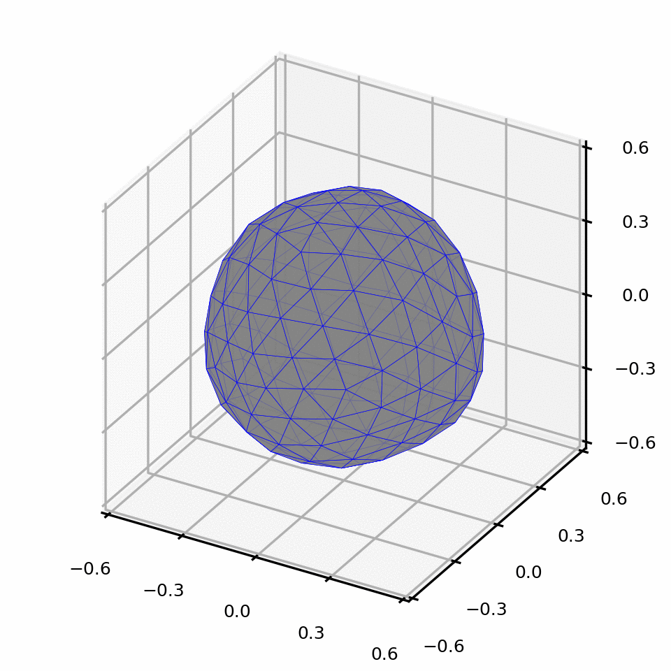
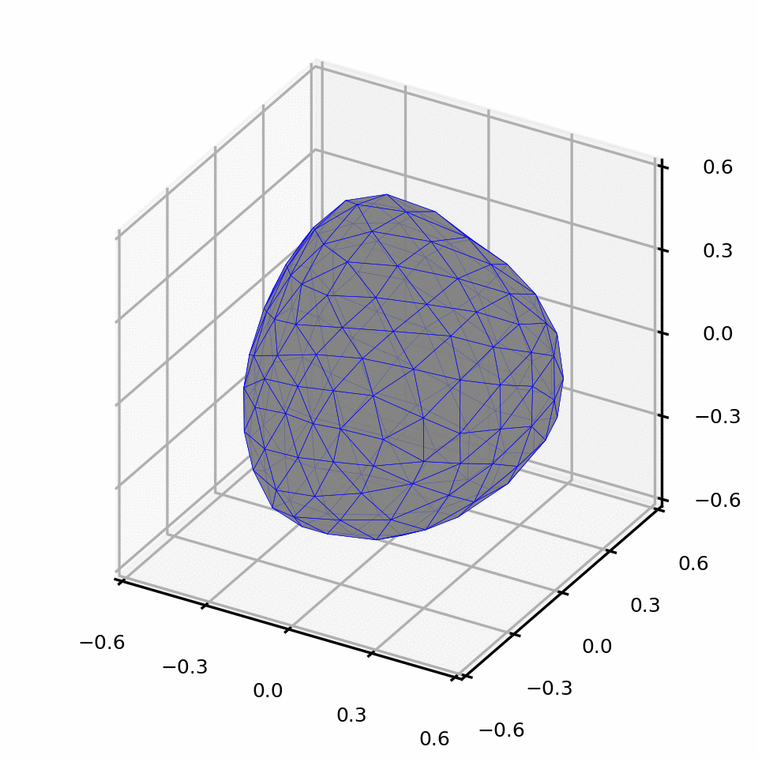
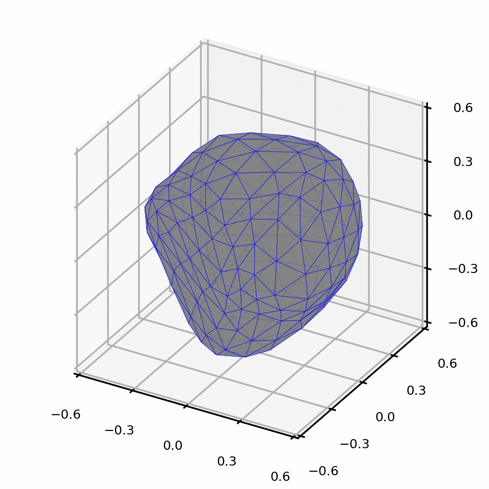
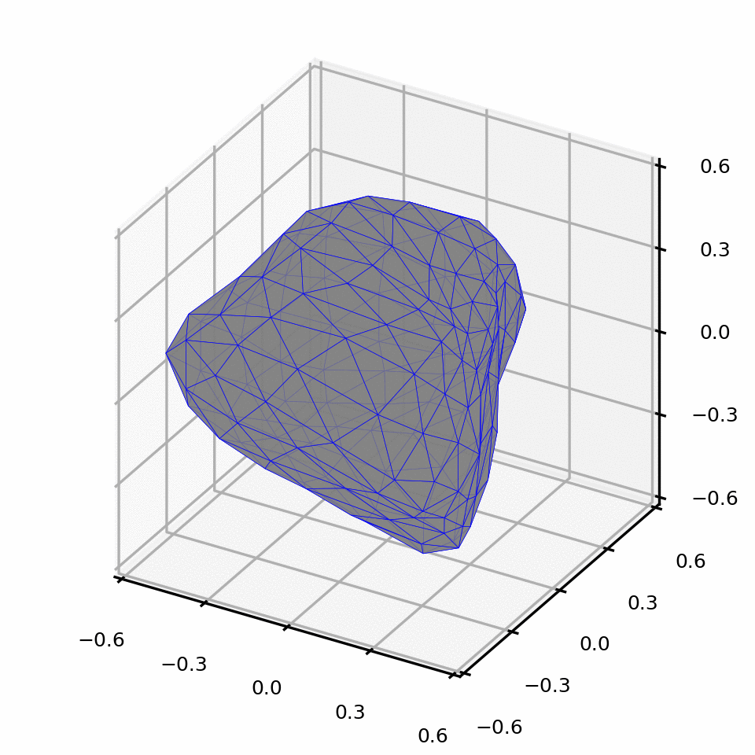

# Spherical Harmonics Particle Shape Generator - SHPSG

* Particle shape influences the properties of granular materials, e.g., packing density, shear strength, permeability. 

* Existing methods generating irregular particle shapes are sometimes over-simplified, e.g., ellipsoids, rod-like particles, or particle 'clusters'.

* This algorithm randomly generates 3D particle morphologies of user-specified irregularity with Spherical Harmonics.

* This algorithm systematically controls shape irregularity at different scales, e.g., form, roundness and roughness.

## Getting started

* These instructions will illustrate the procedures to generate irregular particle shapes with SHPSG.

* The algorithm depends on most common packages in Python.

* The theories were introduced in two papers: rotational-invirant analysis <a href="https://www.mathworks.com/matlabcentral/fileexchange/50105-icosphere" target="_blank">Link</a> and SHs coeffecients random generation method <a href="https://www.sciencedirect.com/science/article/abs/pii/S0032591018301189" target="_blank">Link</a>


## Particle shape

* Particle shape is a multi-scale feature and usually described at three scales, i.e. form, roundness and roughness.

* Spherical Harmonics decompose particle shape features into different scales, SH 'degrees'. For example, particle roundness is well represented with SH coefficients from degree 2 to 8.

* Particle form is defined by three principal dimensions that perpendicular to each other: a$\geq$b$\geq$c. We control two aspect ratios: elongation index Ei = b/a, and flatness index Fi = c/b.

* Particle roundness reflects curvatures at corners. A higher roundness particle has a lower $D_{2-8}$.

* Roughness characterizes surface featureas between corners. A higher roughness particle has a lower $D_{9-15}$.

* The particles are represented by surface meshes with 320 triangular elements. Finer mesh could be used by increasing the mesh subdivision number. A finer surface mesh is needed to show the influence of $D_{9-15}$.


## Parameter control examples

```
A sphere: Ei = 1; Fi = 1; D2_8 = 0; D9_15 = 0

Oblate spheroid: Ei = 1; Fi = 0.5; D2_8 = 0; D9_15 = 0

Probalate spheroid: Ei = 0.5; Fi =1; D2_8 = 0; D9_15 = 0

Low angularity: Ei = 1; Fi = 1; D2_8 = 0.1; D9_15 = 0

High angularity: Ei = 1; Fi = 1; D2_8 = 0.4; D9_15 = 0

```
## Random generated angular particles
```
Ei = 1; Fi = 1; D9_15 = 0
```
D2_8 = 0.1



D2_8 = 0.2



D2_8 = 0.3



D2_8 = 0.4




## License

This project is licensed under the MIT License - see the [LICENSE](LICENSE) file for details

## Acknowledgments

We were inspired by several libraries in our methodology development and code development. We would like to especially thank their authors for the great work and publishing the code.

- [SPHARM-MAT](http://www.iu.edu/~spharm/SPHARM-docs/C01_Introduction.html)
- [icosphere](https://www.mathworks.com/matlabcentral/fileexchange/50105-icosphere)
